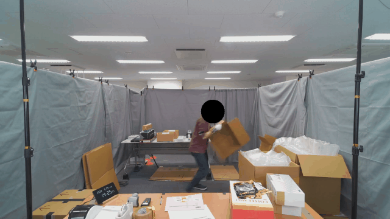

# Video Anonymization Pipeline

This pipeline draws black maskes around faces of the people in the video to anonymization.

## Related Articles

- ["シンプルな ML Pipeline を OpenTelemetry で監視する,"](https://zenn.dev/getty708/articles/20240831-otel-in-ml-pipeline) Zen

## Reference

- [OpenTelemetry と Grafana で Logs と Metrics と Traces を接続する -- Qiita](https://qiita.com/hir00/items/1339f81ffba155195e17)
- [kay421/logs-metrics-traces -- GitHub](https://github.com/kay421/logs-metrics-traces/)
