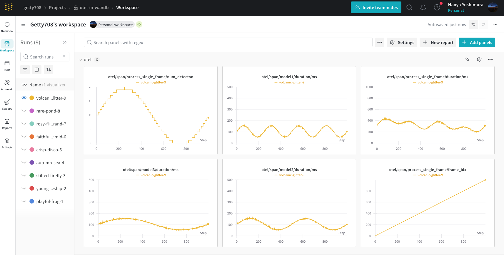

# Monitoring Tools

## `WandbSpanmetricsExporter`

This is a custom exporter of opentelemetry that sends traces as spanmetrics (durations of spans) to `wandb`. This is usefull to record the performance of your application to the wandb. The traces are collected by the opentelemetry python sdk so you can reuse the same motnitoring code to record traces in the production just by adding other exporters.

### DEMO: Record Processing Time in Dummpy ML Pipeline with Weights and Biases

This is a simple example of how to use the `WandbSpanmetricsExporter` to record the processing time of a dummy ML pipeline in the wandb. The example pipeline consists of 3 models and collect traces of each model and the loop to process a single batch. The processing times of each model are as follows:

- `model1`: N(mean=0.1, std=0.001)
- `model2`: N(mean=0.2, std=0.010)
- `model3`: N(mean=0.3, std=0.100)
- (`num_detection`): Sin wave with `A(amplitude)=10 boxes, T(interval)=20 iteration`.

#### How to Run the Example?

- Log in to the wandb by running `wandb login`
- Run the pipeline with the following command:

```python
python services/monitoring/tools/run_otel_in_wandb.py -n 100 -w online
```

Set `--wandb-mode` to `online` to record the results in the wandb (default is `offline`). Then, you can see the processing time of each model in the wandb in real-time.



#### Reference

- [OpenTelemetry を使って Span を W&B に記録する - Zenn](https://zenn.dev/getty708/articles/20241006-wandb-spanmetrics-exporter)
