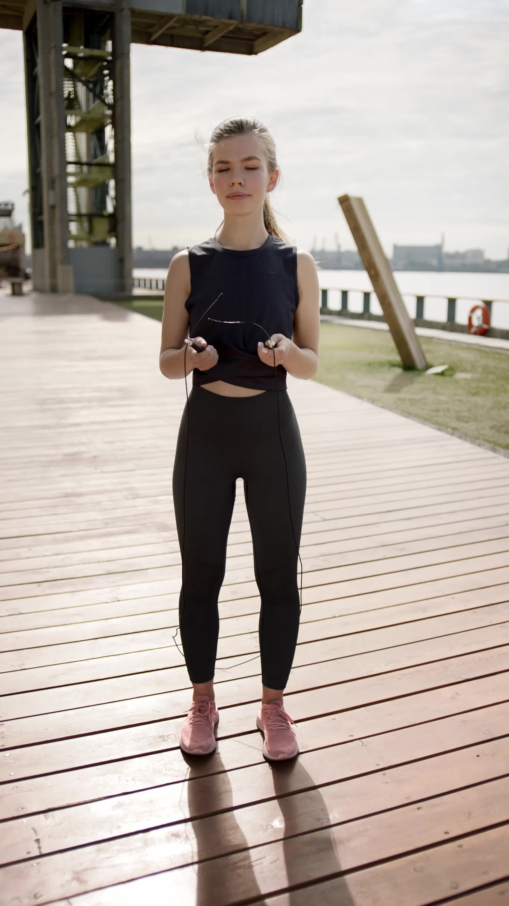

# External Code: from

## References

- [GitHub: facebookresearch/sapiens](https://github.com/facebookresearch/sapiens)
- Hugging Face: [facebook/sapiens](https://huggingface.co/facebook/sapiens)

## Demo: Run the sapiens segmentation on a single image. [`tools/run_inference.py`](./tools/run_inference.py)

- Download models

```bash
$ cd services/segmentation/sapiens
$ make download MODEL_SIZSE=0.6b
```

- Run the demo script

```bash
$ cd services/segmentation/sapiens/tools
$ python run_inference.py -i ./samples/pose/itw_videos/real1/000000.jpg
$ python run_inference.py -i ./samples/seg/face_reel/000001.jpg
```

Segmentation mask (`*_mask.png`) and overlay (`*_mask_overlay.png`) will be saved in the `./outputs` directory. Here are the sample outputs with `0.6b` model.

| Input                                                                                 | Mask                                                                                     | Overlay                                                                                                  |
| ------------------------------------------------------------------------------------- | ---------------------------------------------------------------------------------------- | -------------------------------------------------------------------------------------------------------- |
|  |  |  |
|                  |                  |                  |
